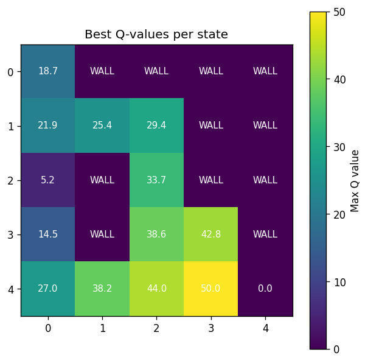

# Q-Learning Maze Practice

A minimal, from-scratch implementation of **tabular Q-learning** that teaches an agent
to navigate a small grid maze from the top-left corner to the bottom-right corner.
No RL libraries — just NumPy for the Q-table and Matplotlib for visualization.

This is a learning project meant to show the core Q-learning loop in the smallest
amount of code possible.

## The maze

```
S . # # #        S = start (0, 0)
. . . # #        G = goal  (4, 4)
. # . # #        . = free cell
. # . . #        # = wall
. . . . G
```

The agent can move **up, down, left, or right**. Hitting a wall or stepping off the
grid ends the episode with a penalty.

## How it works

The agent learns a **Q-table** of shape `(rows, cols, 4)` — one value per
`(state, action)` pair — by repeatedly playing episodes and applying the
Q-learning update rule:

```
Q(s, a) <- Q(s, a) + alpha * ( r + gamma * max_a' Q(s', a') - Q(s, a) )
```

Action selection uses an **epsilon-greedy** policy: with probability `epsilon` the
agent explores a random action, otherwise it exploits the best known action.
`epsilon` decays after every episode, so the agent explores heavily at first and
settles into its learned policy over time.

### Rewards

| Event            | Reward |
|------------------|-------:|
| Reaching the goal | `+50` |
| Hitting a wall / leaving the grid | `-10` |
| Any other step | `-1` |

The per-step penalty pushes the agent toward the **shortest** path rather than any
path.

### Hyperparameters

| Name | Value | Meaning |
|------|------:|---------|
| `num_episodes` | `5000` | training episodes |
| `alpha` | `0.1` | learning rate |
| `gamma` | `0.9` | discount factor (how much future reward matters) |
| `epsilon` | `0.5` -> `0.01` | exploration rate, decays by `*0.995` per episode |

## Result

After training, `heat_map(Q)` renders the **maximum Q-value of each cell**
(`max_a Q(s, a)`) as a heatmap. Brighter cells are worth more to the agent —
you can see the value gradient increasing as cells get closer to the goal,
which traces out the optimal route the agent has learned.



Reading the map: the agent starts at the dim top-left cell and follows the
brightening cells down the left column, across row 1, then down the third column
to the bright goal at the bottom-right. Wall cells are labelled `WALL` and never
get a useful value.

## Running it

```bash
python -m venv .venv
source .venv/bin/activate          # Windows: .venv\Scripts\activate
pip install -r requirements.txt
python main.py
```

Training takes a second or two, then a Matplotlib window opens with the heatmap.

## Things to try

- Change the `maze` layout (`0` = free, `1` = wall) and watch the policy adapt.
- Lower `gamma` to `0.5` and see the value gradient get much steeper / shorter-sighted.
- Set `epsilon = 0` (no exploration) and watch the agent get stuck in a bad policy.
- Add a second goal or a penalty tile and adjust the rewards.

## File layout

```
main.py             # the whole thing: maze, training loop, heatmap
requirements.txt    # numpy, matplotlib
assets/heatmap.png  # example output
```
